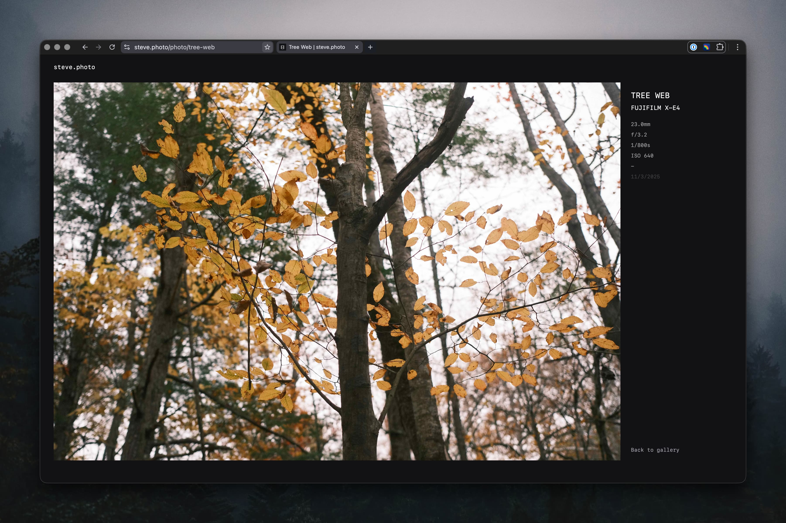

# steve.photo



My personal photography website built with [SvelteKit](https://svelte.dev)

## Features

- Photo gallery with infinite scroll and progressive image loading
- Automatic EXIF metadata extraction (camera, lens, aperture, ISO, etc.)
- Admin panel for uploading, editing, and deleting photos
- RSS feed for content syndication
- SEO optimized with dynamic OpenGraph and Twitter card metadata

## Quickstart

```bash
# Install dependencies
bun install

# Run development server
bun run dev

# Build for production
bun run build

# Deploy to Cloudflare
bun run deploy
```

## Structure

```
src/
├── lib/
│   ├── auth.ts              # HMAC session management
│   ├── feed.ts              # RSS feed photo retrieval
│   ├── types.ts             # TypeScript interfaces
│   └── components/
│       └── ProgressiveImage.svelte
├── routes/
│   ├── +page.svelte         # Gallery with infinite scroll
│   ├── photo/[slug]/        # Photo detail page
│   ├── admin/               # Protected upload panel
│   ├── login/               # Authentication
│   ├── api/photos/          # Pagination endpoint
│   └── rss.xml/             # RSS feed
└── hooks.server.ts          # Session verification
```

## Stack

- **SvelteKit** - Full-stack framework handling routing, SSR, and API endpoints
- **Cloudflare Workers** - Edge runtime for serverless deployment
- **D1 Database** - SQLite database for storing photo metadata
- **R2 Storage** - Object storage for hosting images and thumbnails
